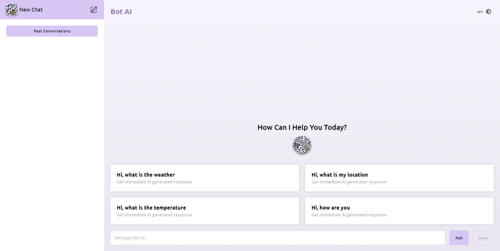
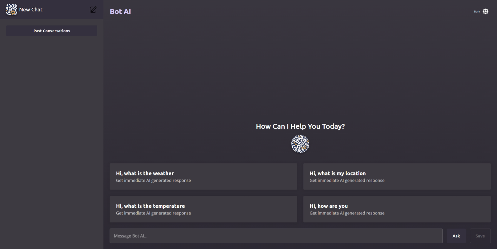
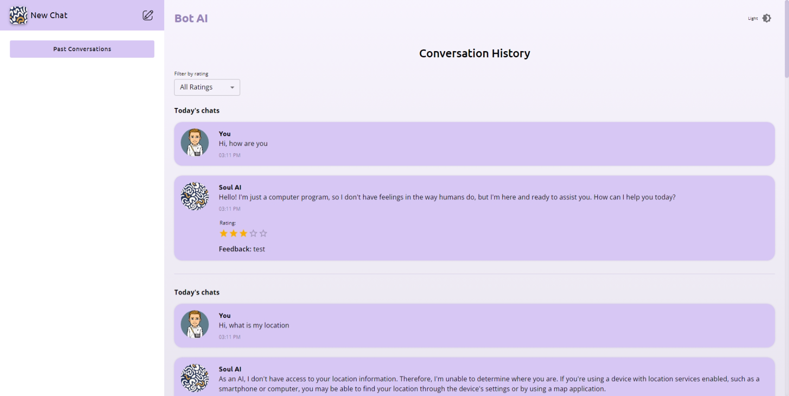
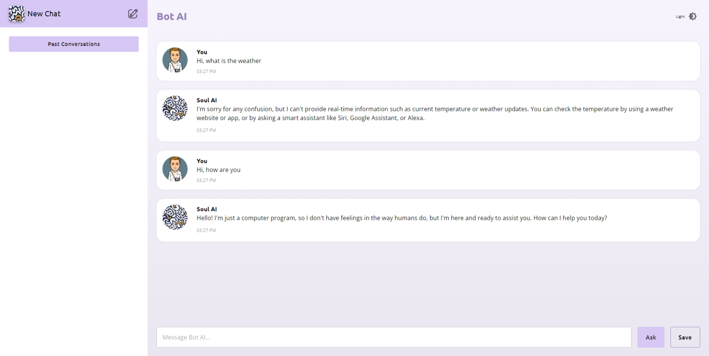

# Bot AI Chatbot

A React application where the user can chat with an AI model. Beyond this, the user can give some feedback and rating at each stage of the conversation.

Website URL: [bot-ai-chatbot.vercel.app](https://bot-ai-chatbot.vercel.app/)

## Technologies used

* React
* Materual UI (MUI)
* date-fns

## Design Choices

- Used Material UI library to keep the Ui consistent.
- Added a toggle for dark mode to improve content readability and reduces eye strain.

## Screenshots

* Light Ui :
  
* Dark Ui :
* Chat History :
  
* Chat Screen :
  
